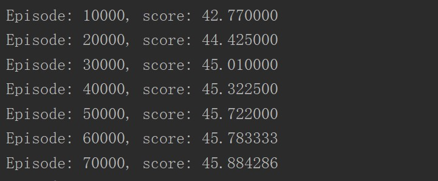

# Q-learning & Policy-Iteration

## Overview of the experiment results

21点游戏的代码文件有：p1\_util.py, p1\_qlearning.py, p1\_policy\_iteration.py
    
三个文件需放到同一目录下，q-learning的实现在p1\_qlearning.py中，policy iteration的实现在p1\_policy\_iteration.py中。这两个文件均可以单独运行。
    
p1\_qlearning.py的运行时间与steps的大小成正比。在训练过程中会打印Episode的数量，平均的胜率，让用户得知训练进度，如图所示。训练结束后会绘制出值函数的图像。关闭图像向后，程序会测试胜率，测试结束后会打印出胜率。
    
p1\_policy\_iteration.py的运行速度很快，大约10s就能得到最终策略。程序会显示出迭代的总次数，并测试胜率。然后绘制出值函数图像。