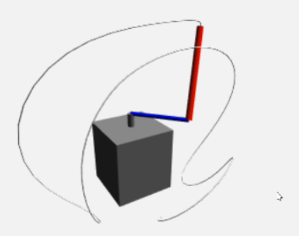
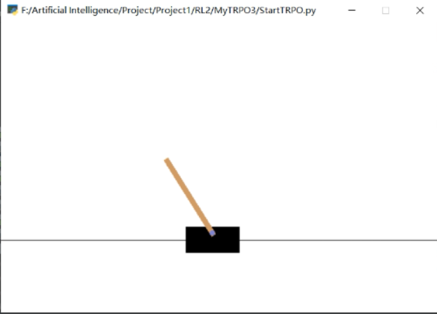

# Reinforce Learning on Quanser Robot Platform

本项目包含 TRPO 和 MPC 在 Quanser Robot Platform 上的实现。

  

## TRPO


## MPC - Model Predictive Control
本项目是对MPC算法在 Quanser Robot Platform 上的实现。
项目结构如下

```
MPC/
    |--MPC-Qube/ MPC on Qube platform
    |   |--run.py/ script to train from scrach
    |   |--test.py/ script to test the train results
    |   |--storage/ figs of loss and rewards and pretained models
    |	|   |--data_exp_7.pkl/: The pre-collected dataset
    |	|   |--exp_7.ckpt/：The pretrained MPC model on Qube
    |
    |--MPC-CartPoleSwing/ MPC on CartPoleSwing platform
    |   |--run.py/ script to train from scrach
    |   |--storage/ figs of loss and rewards and pretained models
    |	|   |--data_exp_7.pkl/: The pre-collected dataset
    |	|   |--exp_7.ckpt/The pretrained MPC model on CartPoleSwing
    |
    |--MPC-BallBalancer/ MPC on CartPoleSwing platform
    |   |--run.py/ script to train from scrach
    |   |--storage/ figs of loss and rewards and pretained models
    |	|   |--data_exp_7.pkl/: The pre-collected dataset
    |	|   |--exp_7.ckpt/：The pretrained MPC model on BallBalancer
    |
    |--README.md
```


